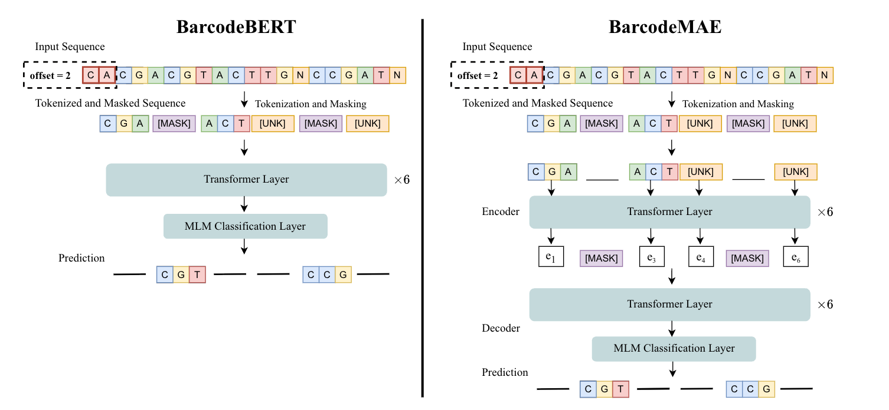

# BarcodeMAE

A PyTorch implementation of BarcodeMAE, a model for enhancing DNA foundation models to address masking inefficiencies.

<p align="center">
  
</p>

#### Check out our [paper](https://arxiv.org/pdf/2502.18405)

#### Model checkpoint is available here: [BarcodeMAE](https://drive.google.com/file/d/18TqKC_gLYYDZEFfkMBRvWTHTT8Vb74Wv/view?usp=drive_link)

### Reproducing the results

0. Download the checkpoint and copy it to the model_checkpoints directory
1. Run KNN evaluation
   
```shell
python barcodebert/knn_probing.py \
  --run-name knn_evaluation \
  --data-dir ./data/ \
  --pretrained-checkpoint "./model_checkpoints/best_pretraining.pt"\
  --log-wandb \
  --dataset BIOSCAN-5M \
```

### Pretraining from scratch

0. Clone this repository and install the required libraries by running.

```shell
pip install -e .
```

1. Download the [metadata file](https://drive.google.com/drive/u/0/folders/1TLVw0P4MT_5lPrgjMCMREiP8KW-V4nTb) and copy it into the data folder
2. Split the metadata file into smaller files according to the different partitions as presented in the [BIOSCAN-5M paper](https://arxiv.org/abs/2406.12723)

```shell
cd data/
python data_split.py BIOSCAN-5M_Dataset_metadata.tsv
```
3. Pretrain BarcodeMAE

```shell
python barcodebert/pretraining.py \
  --dataset=BIOSCAN-5M \
  --k_mer=6 \
  --n_layers=6 \
  --n_heads=6 \
  --decoder-n-layers=6 \
  --decoder-n-heads=6 \
  --data_dir=data/ \
  --checkpoint=model_checkpoints/BIOSCAN-5M/6-6-6/model_checkpoint.pt
```

## Citation

If you find BarcodeMAE useful in your research please consider citing:

```bibtex
@article{safari2025barcodemae,
  title={Enhancing DNA Foundation Models to Address Masking Inefficiencies},
  author={Monireh Safari
    and Pablo Millan Arias
    and Scott C. Lowe
    and Lila Kari
    and Angel X. Chang
    and Graham W. Taylor
  },
  journal={arXiv preprint arXiv:2502.18405}
  year={2025},
  eprint={2502.18405},
  archivePrefix={arXiv},
  primaryClass={cs.LG},
  doi={10.48550/arXiv.2502.18405},
}
```
