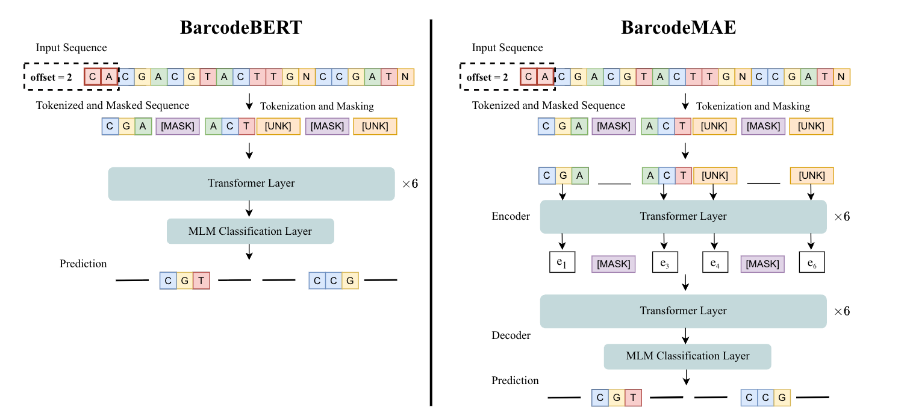

# BarcodeMAE

A PyTorch implementation of BarcodeMAE, a model for enhancing DNA foundation models to address masking inefficiencies.

<p align="center">
  
</p>

#### Check out our [paper](https://arxiv.org/pdf/2502.18405)

#### Model checkpoint is available here: [BarcodeMAE](https://drive.google.com/file/d/18TqKC_gLYYDZEFfkMBRvWTHTT8Vb74Wv/view?usp=drive_link)

## Table of Contents
- [Quick Start](#quick-start)
- [Setup](#setup)
- [Preparing the Data](#preparing-the-data)
- [Reproducing the Results](#reproducing-the-results)
- [Pretraining from Scratch](#pretraining-from-scratch)
- [Jumbo Taxonomy Classification](#jumbo-taxonomy-classification)
  - [Quick Start with Taxonomy Classification](#quick-start-with-taxonomy-classification)
  - [Architecture Comparison](#architecture-comparison)
  - [Key Parameters](#key-parameters)
  - [Advanced Usage](#advanced-usage)
  - [How It Works](#how-it-works)
  - [When to Use Which Architecture](#when-to-use-which-architecture)
  - [Testing](#testing)
  - [Detailed Documentation](#detailed-documentation)
- [Citation](#citation)

### Quick start

Use this jupyter notebook for quick start: [Quick start](https://colab.research.google.com/drive/17fXgva89PzC29cgegjqsuKPZ6KGXpguc?usp=sharing)

### Setup

0. Clone this repository
1. Install the required libraries

```shell
pip install -r requirements.txt
pip install -e .
```

### Preparing the data

1. Download the [metadata file](https://drive.google.com/drive/u/0/folders/1TLVw0P4MT_5lPrgjMCMREiP8KW-V4nTb) and copy it into the data folder
2. Split the metadata file into smaller files according to the different partitions as presented in the [BIOSCAN-5M paper](https://arxiv.org/abs/2406.12723)

```shell
cd data/
python data_split.py BIOSCAN-5M_Dataset_metadata.tsv
```

### Reproducing the results


1. Download the checkpoint and copy it to the model_checkpoints directory
2. Run KNN evaluation

```shell
python barcodebert/knn_probing.py \
  --run-name knn_evaluation \
  --data-dir ./data/ \
  --pretrained-checkpoint "./model_checkpoints/best_pretraining.pt"\
  --log-wandb \
  --dataset BIOSCAN-5M
```

### Pretraining from scratch


1. Run pretraining

```shell
python barcodebert/pretraining.py \
  --dataset=BIOSCAN-5M \
  --k_mer=6 \
  --n_layers=6 \
  --n_heads=6 \
  --decoder-n-layers=6 \
  --decoder-n-heads=6 \
  --data_dir=data/ \
  --checkpoint=model_checkpoints/BIOSCAN-5M/6-6-6/model_checkpoint.pt
```

## Jumbo Taxonomy Classification

BarcodeMAE now supports **Jumbo CLS tokens** for auxiliary taxonomy classification during pretraining. This feature enables the model to learn taxonomic relationships alongside masked token reconstruction, improving representation quality.

### Quick Start with Taxonomy Classification

#### MAELM Architecture (Encoder-Decoder)

**Option 1: Use encoder jumbo tokens** (faster, compressed representation)
```shell
python barcodebert/pretraining.py \
  --arch maelm \
  --jumbo \
  --enable-taxonomy-classification \
  --jumbo-source encoder \
  --taxonomy-level genus \
  --dataset BIOSCAN-5M \
  --data_dir data/ \
  --checkpoint model_checkpoints/maelm_encoder_genus.pt
```

**Option 2: Use decoder jumbo tokens** (richer, full-context representation)
```shell
python barcodebert/pretraining.py \
  --arch maelm \
  --jumbo \
  --enable-taxonomy-classification \
  --jumbo-source decoder \
  --taxonomy-level genus \
  --dataset BIOSCAN-5M \
  --data_dir data/ \
  --checkpoint model_checkpoints/maelm_decoder_genus.pt
```

#### Transformer Architecture (Single Encoder)

**Standard BERT-style with jumbo tokens**
```shell
python barcodebert/pretraining.py \
  --arch transformer \
  --jumbo \
  --enable-taxonomy-classification \
  --taxonomy-level genus \
  --dataset BIOSCAN-5M \
  --data_dir data/ \
  --checkpoint model_checkpoints/transformer_genus.pt
```

### Architecture Comparison

| Feature | MAELM (Encoder Source) | MAELM (Decoder Source) | Transformer |
|---------|----------------------|----------------------|-------------|
| **Structure** | Encoder-decoder | Encoder-decoder | Single encoder |
| **Jumbo Source** | Encoder output | Decoder output | Encoder output |
| **Context** | Unmasked tokens only | Full reconstructed sequence | Full sequence |
| **Speed** | Medium | Slower | Fastest |
| **Memory** | Higher | Higher | Lower |
| **Use Case** | Compressed features | Rich context | Simple baseline |

### Key Parameters

#### Taxonomy Classification
- `--enable-taxonomy-classification`: Enable taxonomy classification head
- `--taxonomy-level`: Taxonomic level (options: `phylum`, `class`, `order`, `family`, `genus`, `species`)
- `--taxonomy-loss-weight`: Weight for taxonomy loss (default: `0.1`)

#### Jumbo Configuration
- `--jumbo`: Enable Jumbo CLS tokens (required for taxonomy classification)
- `--jumbo_multiplier`: Number of jumbo CLS tokens (default: `6`)
- `--share_jumbo_layers`: Share jumbo MLP across transformer layers

#### MAELM-Specific
- `--jumbo-source`: Source of jumbo tokens for classification
  - `encoder`: Direct from encoder (faster, compressed)
  - `decoder`: After decoder processing (richer, full context)

### Advanced Usage

#### With All Options
```shell
python barcodebert/pretraining.py \
  --arch maelm \
  --dataset BIOSCAN-5M \
  --k_mer 6 \
  --n_layers 6 \
  --n_heads 6 \
  --embed_dim 384 \
  --decoder-n-layers 6 \
  --decoder-n-heads 6 \
  --decoder-embed-dim 384 \
  --jumbo \
  --jumbo_multiplier 6 \
  --share_jumbo_layers \
  --enable-taxonomy-classification \
  --jumbo-source decoder \
  --taxonomy-level genus \
  --taxonomy-loss-weight 0.1 \
  --data_dir data/ \
  --checkpoint model_checkpoints/full_config.pt \
  --log-wandb \
  --run-name maelm_decoder_genus
```

#### Multiple Taxonomic Levels
You can train separate models for different taxonomic levels:

```shell
# Family-level classification
python barcodebert/pretraining.py \
  --enable-taxonomy-classification \
  --taxonomy-level family \
  --run-name model_family

# Species-level classification
python barcodebert/pretraining.py \
  --enable-taxonomy-classification \
  --taxonomy-level species \
  --run-name model_species
```

### How It Works

#### Jumbo CLS Tokens
- **J** special CLS tokens are prepended to the input sequence
- These tokens aggregate global information through self-attention
- Processed through a wide MLP (Jumbo MLP) separate from regular tokens
- Used for taxonomy classification via pairwise comparison

#### Taxonomy Classification
- **Binary pairwise classifier**: Predicts if two samples share the same taxonomic label
- Creates balanced pairs (50% same taxonomy, 50% different)
- Loss: Binary cross-entropy on pairwise predictions
- Total loss: `reconstruction_loss + taxonomy_weight × taxonomy_loss`

#### MAELM Jumbo Source
1. **Encoder source**:
   - Jumbo tokens from encoder output (compressed representation)
   - Based on unmasked tokens only
   - Faster, direct classification

2. **Decoder source**:
   - Jumbo tokens after decoder processing
   - Full sequence context (masked + reconstructed tokens)
   - Richer representation, but slower

### When to Use Which Architecture

#### Use MAELM + Encoder Source When:
- ✅ You want the original MAE architecture
- ✅ Classification from compressed representation
- ✅ Faster training within MAELM
- ✅ Independent of reconstruction quality

#### Use MAELM + Decoder Source When:
- ✅ You want full sequence context for classification
- ✅ Reconstruction should inform taxonomy
- ✅ Interested in decoder-refined representations
- ✅ Willing to trade speed for richer features

#### Use Transformer When:
- ✅ You want the simplest architecture
- ✅ Comparing to BERT/DNABERT baselines
- ✅ Speed and memory are priorities
- ✅ Don't need encoder-decoder complexity

### Testing

Run unit tests to verify the implementation:

```shell
# Test MAELM with different jumbo sources
python -m barcodebert.test_maelm_shapes

# Test transformer with taxonomy classification
python -m barcodebert.test_transformer_taxonomy
```

### Detailed Documentation

📚 **[Complete Documentation Index](barcodebert/DOCUMENTATION_INDEX.md)** - Central navigation for all documentation

For comprehensive guides, see:
- **[TAXONOMY_CLASSIFICATION_SUMMARY.md](barcodebert/TAXONOMY_CLASSIFICATION_SUMMARY.md)**: Quick reference for all options
- **[JUMBO_SOURCE_GUIDE.md](barcodebert/JUMBO_SOURCE_GUIDE.md)**: Detailed guide for MAELM jumbo sources
- **[TRANSFORMER_TAXONOMY_GUIDE.md](barcodebert/TRANSFORMER_TAXONOMY_GUIDE.md)**: Guide for transformer architecture
- **[JUMBO_SOURCE_SUMMARY.md](barcodebert/JUMBO_SOURCE_SUMMARY.md)**: Implementation summary
- **[barcodebert/README.md](barcodebert/README.md)**: Implementation details and API reference

### Example Results

After training with taxonomy classification, you can evaluate using KNN probing:

```shell
python barcodebert/knn_probing.py \
  --pretrained-checkpoint model_checkpoints/maelm_decoder_genus.pt \
  --dataset BIOSCAN-5M \
  --data-dir data/ \
  --log-wandb \
  --run-name knn_with_taxonomy
```

## Citation

If you find BarcodeMAE useful in your research please consider citing:

```bibtex
@article{safari2025barcodemae,
  title={Enhancing DNA Foundation Models to Address Masking Inefficiencies},
  author={Monireh Safari
    and Pablo Millan Arias
    and Scott C. Lowe
    and Lila Kari
    and Angel X. Chang
    and Graham W. Taylor
  },
  journal={arXiv preprint arXiv:2502.18405},
  year={2025},
  eprint={2502.18405},
  archivePrefix={arXiv},
  primaryClass={cs.LG},
  doi={10.48550/arXiv.2502.18405},
}
```
