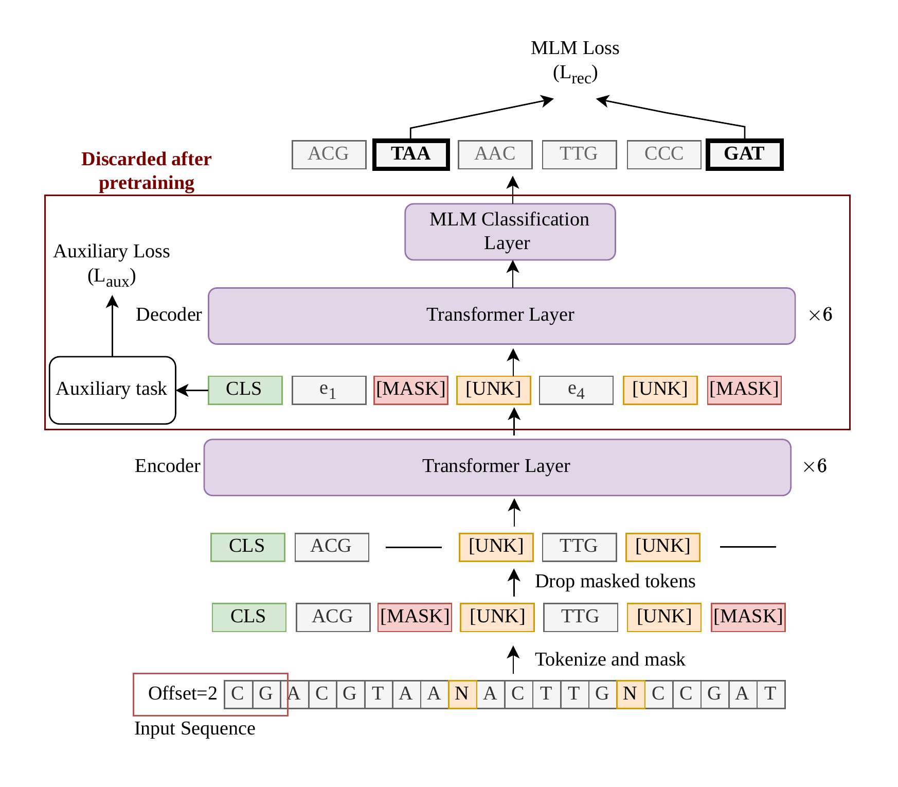

# BarcodeMAE+

A PyTorch implementation of BarcodeMAE+, a model for enhancing DNA foundation models to address masking inefficiencies.

<p align="center">
  
</p>

#### Check out our paper (link coming soon)

#### Model checkpoints are available here: (link coming soon)

## Setup

0. Clone this repository and create an environment (Python 3.10+; developed and tested on 3.11)

```shell
git clone <this-repo-url>
cd BarcodeMAE-plus
python3.11 -m venv .venv
source .venv/bin/activate
```

1. Install the required libraries

```shell
pip install -r requirements.txt
pip install -e .
```

## Preparing the data

### BIOSCAN-5M

BIOSCAN-5M is distributed by its own [repo](https://github.com/bioscan-ml/BIOSCAN-5M) via Google Drive, Zenodo, HuggingFace, and Kaggle. The repo itself only documents manual Google Drive access, but the Zenodo and HuggingFace copies have stable, scriptable download URLs that work well on a headless server. For this pipeline you only need the metadata (not the image packages):

1. Download the metadata archive and extract it into `data/` (`data_split.py` reads `processid`, `dna_barcode`, `chunk`, `split`, and the taxonomic label columns, and works with either the CSV or TSV variant):

```shell
cd data/
wget -O BIOSCAN_5M_Insect_Dataset_metadata_MultiTypes.zip \
  "https://zenodo.org/api/records/11973457/files/BIOSCAN_5M_Insect_Dataset_metadata_MultiTypes.zip/content"
unzip BIOSCAN_5M_Insect_Dataset_metadata_MultiTypes.zip
```

This extracts into a `bioscan5m/metadata/` directory with separate `csv/` and `jsonld/` subfolders (no `tsv/` in the current release) — the file you want is `bioscan5m/metadata/csv/BIOSCAN_5M_Insect_Dataset_metadata.csv`.

Or via HuggingFace instead:

```shell
hf download Gharaee/BIOSCAN-5M --repo-type dataset --local-dir data/BIOSCAN-5M
```

2. Split it into the train/val/test partitions as presented in the [BIOSCAN-5M paper](https://arxiv.org/abs/2406.12723):

```shell
python data_split.py bioscan5m/metadata/csv/BIOSCAN_5M_Insect_Dataset_metadata.csv
```

### Fungal ITS / UNITE+INSD

The ITS data and its preprocessing come from MycoAI ([Romeijn et al., 2024](https://onlinelibrary.wiley.com/doi/10.1111/1755-0998.14006); [repo](https://github.com/MycoAI/MycoAI)). `knn_its_clean.py`, `knn_its_mycoai.py`, and `analyze_its_overlap.py` (below) all depend on the `mycoai-its` package for its UNITE-header FASTA parser:

```shell
pip install mycoai-its==0.0.5
```

`mycoai`'s own `__init__.py` calls `wandb.login('allow')` as an import-time side effect, which can hang or crash with a `ServiceStartTimeoutError` on compute nodes with a restricted/no-network `/tmp` (nothing to do with our own wandb usage — this happens just from `import mycoai`, before any of our code runs). If you hit that, disable wandb before running anything that touches ITS-5M data (`analyze_its_overlap.py`, `knn_its_clean.py`, `knn_its_mycoai.py`):

```shell
export WANDB_MODE=disabled
```

Download the training + test data (5,230,185 sequences, ~920 MB) directly from Zenodo and extract into `data/ITS-5M/`:

```shell
mkdir -p data/ITS-5M && cd data/ITS-5M
wget -O data.zip "https://zenodo.org/api/records/10946477/files/data.zip/content"
unzip data.zip
```

This should give you `trainset.fasta` / `trainset_labels.csv` and the held-out test sets `knn_its_clean.py` expects (`test1.fasta` = Yeast, `test2.fasta` = Filamentous, `test3.fasta` = MycoAI's own test set — check the archive's contents against [MycoAI's `data/` folder](https://github.com/MycoAI/MycoAI/tree/master/data) if any are missing).

Optionally, run `data/preprocess_its.py` to apply the BarcodeMamba+-style filtering (drop duplicate sequence-label pairs, outlier-length sequences, sequences with >5% ambiguous bases, and rare labels — see the script's docstring for the full recipe).

### Deduplicated evaluation task files (`--tasks-dir`)

`knn_its_clean.py`, `knn_its_mycoai.py`, and `knn_its_barcodemamba.py` all take a `--tasks-dir` pointing at CSVs produced by `analyze_its_overlap.py`. That script re-parses each test set's raw UNITE FASTA headers directly (not the pre-factorized `*_labels.csv`, whose `species` column collapses any species outside the training vocabulary into one shared "unknown" bucket), removes query specimens that are exact-duplicate or same-read/different-trim ("substring") duplicates of training sequences, and labels each remaining query `species_level` or `genus_level` depending on whether its species or only its genus was seen during training:

```shell
python barcodebert/analyze_its_overlap.py \
  --data-dir ./data/ITS-5M \
  --export-dir ./data/ITS-5M/tasks
```

This also prints the train/test overlap breakdown per test set (species/genus/barcode overlap, exact vs. substring duplicates) used for the paper's overlap audit. Pass `--include-leaked` to export the *non*-deduplicated counterpart of the same task files instead (same task definitions, but without excluding duplicate specimens), if you want to compare against the deduplicated numbers.

## Quick start

Load a pretrained checkpoint and run evaluation directly.

### Load a checkpoint

```python
import torch
from barcodebert.io import load_pretrained_model

device = "cuda" if torch.cuda.is_available() else "cpu"
model, ckpt = load_pretrained_model("model_checkpoints/bioscan5m_best.pt", device=device)
```

This prints the checkpoint's architecture and training diagnostics (encoder-decoder vs. encoder-only, CLS/Jumbo config, epochs trained) and returns the ready-to-use encoder plus the raw checkpoint dict.

### Run evaluation

Best BIOSCAN-5M configuration (encoder-decoder MAE-LM + CLS + cross-entropy genus classification, `cls` representation, similarity-weighted softmax KNN voting):

```shell
python barcodebert/knn_probing.py \
  --pretrained-checkpoint model_checkpoints/bioscan5m_best.pt \
  --data-dir ./data/ \
  --dataset BIOSCAN-5M \
  --representation_type cls \
  --knn-weights softmax \
  --temperature 0.02 \
  --n-neighbors 1 3 5 7 10 15 20 25 50
```

Best fungal ITS / UNITE+INSD configuration (encoder-decoder MAE-LM + CLS + binary same-genus objective, `cls` representation, deduplicated genus-level evaluation — this evaluates the Yeast, Filamentous, and MycoAI test sets in one pass):

```shell
python barcodebert/knn_its_clean.py \
  --pretrained-checkpoint model_checkpoints/its_best.pt \
  --data-dir ./data/ITS-5M/ \
  --tasks-dir ./data/ITS-5M/tasks/ \
  --representation-type cls \
  --knn-weights softmax \
  --temperature 0.02 \
  --n-neighbors 1 3 5 7 10 15 20 25 50 \
  --tasks genus_level
```

## Pretraining

All ten configurations in the paper (encoder-decoder MAE-LM vs. encoder-only Transformer, with/without a CLS token, and each of the three auxiliary objectives) are trained with `barcodebert/pretraining.py`. Encoder/decoder are both 6 layers, 6 heads, hidden dimension 768, following BarcodeBERT; masking ratio is fixed at 50% internally (not a CLI flag).

### Worked example: best BIOSCAN-5M config (encoder-decoder + CLS + cross-entropy)

```shell
python barcodebert/pretraining.py \
  --run-name bioscan5m_maelm_cls_ce \
  --dataset BIOSCAN-5M \
  --data-dir data/BIOSCAN-5M \
  --arch maelm \
  --k-mer 6 --stride 6 \
  --n-layers 6 --n-heads 6 \
  --decoder-n-layers 6 --decoder-n-heads 6 \
  --batch-size 128 \
  --lr 0.00007 \
  --weight-decay 0.00001 \
  --epochs 35 \
  --mask-token-ratio 1.0 \
  --random-token-ratio 0.0 \
  --masked-loss-weight 0.999 \
  --max-norm 0.5 \
  --separate_loss true \
  --mixed-precision \
  --save-best-model \
  --use-cls-token \
  --aux-loss-type ce \
  --aux-loss-weight 0.1 \
  --aux-loss-warmup-epochs 5 \
  --taxonomy-level genus \
  --taxonomy-max-pairs 128 \
  --k-classes 16 \
  --m-per-class 4 \
  --checkpoint model_checkpoints/BIOSCAN-5M/maelm_cls_ce/checkpoint.pt \
  --checkpoint_maelm model_checkpoints/BIOSCAN-5M/maelm_cls_ce/checkpoint_encoder.pt
```

For `--arch maelm` checkpoints, evaluation (Quick start / `knn_probing.py`) should point at the `--checkpoint_maelm` encoder-only file, not `--checkpoint`. For `--arch transformer`, use `--checkpoint` directly (no decoder to strip).

### Other configurations

Keep everything above the same and swap in these flags for the architecture/CLS/objective you want:

| Config | Architecture | CLS | Objective | Extra flags (on top of the base architecture flags) |
|---|---|---|---|---|
| 1 | encoder-decoder (`--arch maelm`) | no | — | *(none)* |
| 2 | encoder-decoder | yes | none | `--use-cls-token` |
| 3 | encoder-decoder | yes | binary | `--use-cls-token --enable-cls-taxonomy --cls-taxonomy-loss-weight 0.1 --taxonomy-level genus --taxonomy-max-pairs 128 --k-classes 16 --m-per-class 4` |
| 4 | encoder-decoder | yes | triplet | `--use-cls-token --aux-loss-type triplet --triplet-margin 0.0 --triplet-mining batch_hard --aux-loss-weight 0.1 --aux-loss-warmup-epochs 5 --taxonomy-level genus --taxonomy-max-pairs 128 --k-classes 16 --m-per-class 4` |
| 5 | encoder-decoder | yes | CE | `--use-cls-token --aux-loss-type ce --aux-loss-weight 0.1 --aux-loss-warmup-epochs 5 --taxonomy-level genus --taxonomy-max-pairs 128 --k-classes 16 --m-per-class 4` |
| 6–10 | encoder-only (`--arch transformer`, drop `--decoder-n-layers/--decoder-n-heads/--checkpoint_maelm`) | same as 1–5 | same as 1–5 | same as 1–5 |

For fungal ITS / UNITE+INSD, use `--dataset ITS-5M --data-dir data/ITS-5M --epochs 15`; everything else (including the CLS/objective flags above) is unchanged.

The exact SLURM job arrays that generated the paper's checkpoints — including run naming and checkpoint paths — are in [`slurm/bioscan5m_final.sh`](slurm/bioscan5m_final.sh) and [`slurm/fungi_its_final.sh`](slurm/fungi_its_final.sh). Edit the `#SBATCH --account` and any `$HOME`/`$SCRATCH`-relative paths at the top for your own cluster before submitting.

## Evaluating the external baselines

Table 3 (BIOSCAN-5M) and Table 4 (UNITE+INSD) compare BarcodeMAE+ against published DNA foundation models and fungal-ITS-specific baselines. None of these are retrained from scratch — each is evaluated zero-shot from its own published checkpoint.

### HuggingFace-hosted baselines (DNABERT-2, DNABERT-S, Nucleotide Transformer, GENA-LM, HyenaDNA-tiny, Caduceus-PS-1k)

These are exactly the encoder-only and state-space baselines reported in Tables 3 and 4 of the paper (BarcodeBERT, MycoAI, and BarcodeMamba+ are covered separately below since they aren't HuggingFace `AutoModel` checkpoints). They need a separate environment with a newer `transformers` than the main training venv (see the header of `requirements-external-baselines.txt` for why — bumping the shared venv risks breaking Jumbo BERT pretraining):

```shell
python3.11 -m venv --system-site-packages .venv-external
source .venv-external/bin/activate
pip install -r requirements-external-baselines.txt
```

`barcodebert/external_models.py` wraps each checkpoint's HuggingFace `AutoModel`/`AutoModelForMaskedLM`/`AutoModelForCausalLM` so it can be evaluated with the same KNN pipeline used for BarcodeMAE+. `--external-model-cls` must match how the checkpoint is loaded:

| Model | `--external-model-id` | `--external-model-cls` | `--external-max-length` |
|---|---|---|---|
| DNABERT-2 | `zhihan1996/DNABERT-2-117M` | `auto` | 660 |
| DNABERT-S | `zhihan1996/DNABERT-S` | `auto` | 660 |
| Nucleotide Transformer | `InstaDeepAI/nucleotide-transformer-500m-human-ref` | `auto` | 660 |
| GENA-LM | `AIRI-Institute/moderngena-base` | `auto` | 660 |
| HyenaDNA-tiny | `LongSafari/hyenadna-tiny-1k-seqlen-hf` | `causal-lm` | 1000 |
| Caduceus-PS-1k | `kuleshov-group/caduceus-ps_seqlen-1k_d_model-256_n_layer-4_lr-8e-3` | `masked-lm` | 1000 |

```shell
# BIOSCAN-5M
python barcodebert/knn_probing.py \
  --external-model-id zhihan1996/DNABERT-2-117M \
  --external-model-cls auto \
  --external-max-length 660 \
  --dataset BIOSCAN-5M \
  --data-dir ./data/BIOSCAN-5M \
  --taxon genus \
  --knn-weights softmax --temperature 0.02 \
  --n-neighbors 1 3 5 7 10 15 20 25 50

# Fungal ITS / UNITE+INSD
python barcodebert/knn_its_clean.py \
  --external-model-id zhihan1996/DNABERT-2-117M \
  --external-model-cls auto \
  --external-max-length 660 \
  --data-dir ./data/ITS-5M \
  --tasks-dir ./data/ITS-5M/tasks \
  --knn-weights softmax --temperature 0.02 \
  --n-neighbors 1 3 5 7 10 15 20 25 50
```

Caduceus needs `mamba-ssm`/`causal-conv1d` (CUDA kernels) on top of `requirements-external-baselines.txt` — see the commented-out block at the end of that file.

### MycoAI-BERT / MycoAI-CNN (fungal ITS only)

These ship as `mycoai.modules.seq_class_network.SeqClassNetwork` checkpoints (not HuggingFace). Evaluated in the main venv — `mycoai` is already a dependency for ITS-5M data loading.

```shell
wget -O MycoAI-BERT.pt "https://zenodo.org/api/records/10904344/files/MycoAI-BERT.pt/content"
wget -O MycoAI-CNN.pt "https://zenodo.org/api/records/10904344/files/MycoAI-CNN.pt/content"
```

```shell
python barcodebert/knn_its_mycoai.py \
  --checkpoint path/to/MycoAI-BERT.pt \
  --data-dir ./data/ITS-5M \
  --tasks-dir ./data/ITS-5M/tasks \
  --knn-weights softmax --temperature 0.02 \
  --n-neighbors 1 3 5 7 10 15 20 25 50
```

### BarcodeMamba+

A state-space model distributed as a plain GitHub repo (not a HuggingFace `AutoModel`), so it needs a local clone of that repo plus its checkpoint directory:

```shell
# BIOSCAN-5M
python barcodebert/knn_probing_barcodemamba.py \
  --barcodemamba-repo path/to/BarcodeMamba-plus-repo \
  --checkpoint-dir path/to/barcodemamba_checkpoints \
  --data-dir ./data/BIOSCAN-5M \
  --knn-weights softmax --temperature 0.02 \
  --n-neighbors 1 3 5 7 10 15 20 25 50

# Fungal ITS / UNITE+INSD
python barcodebert/knn_its_barcodemamba.py \
  --barcodemamba-repo path/to/BarcodeMamba-plus-repo \
  --checkpoint-dir path/to/barcodemamba_checkpoints \
  --data-dir ./data/ITS-5M \
  --tasks-dir ./data/ITS-5M/tasks \
  --knn-weights softmax --temperature 0.02 \
  --n-neighbors 1 3 5 7 10 15 20 25 50
```

### BarcodeBERT

BarcodeBERT is the same architecture family as BarcodeMAE+ (this repo, prior work), so its checkpoint is evaluated the same way as any of our own checkpoints — just point `--pretrained-checkpoint` at the BarcodeBERT checkpoint in `knn_probing.py` / `knn_its_clean.py` (Quick start above).

## Citation

If you find BarcodeMAE+ useful in your research please consider citing:

```bibtex
@article{safari2025barcodemae,
  title={Enhancing DNA Foundation Models to Address Masking Inefficiencies},
  author={Monireh Safari
    and Pablo Millan Arias
    and Scott C. Lowe
    and Lila Kari
    and Angel X. Chang
    and Graham W. Taylor
  },
  journal={arXiv preprint arXiv:2502.18405},
  year={2025},
  eprint={2502.18405},
  archivePrefix={arXiv},
  primaryClass={cs.LG},
  doi={10.48550/arXiv.2502.18405},
}
```

<!-- BarcodeMAE+ (GigaScience, in preparation) citation to be added once available. -->